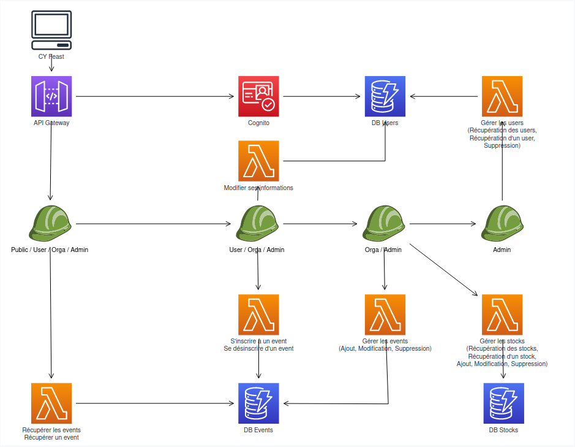

# CY-2023_Perpective2-AWS
## Modéliser et codage d'une une infrastructure Cloud Serverless

## Attendus
### Etape 1
En binôme, modélisez une infrastructure Cloud Serverless AWS correspondant au back-end du projet du module Angular à savoir :
- des rôles public, utilisateur identifié, organisateur d'événements, admin
- un utilisateur peut lister les événements et s'y inscrire
- un organisateur peut gérer les stocks et créer des événements
- un admin hérite des autres fonctions et peut gérer les utilisateurs

Par ailleurs :
- utilisez un système délégué pour gérer les identifications (service tiers)
- stockez les informations des utilisateurs pour connaître leurs nom / prénom et les événéments auxquels ils assistent
- prenez en compte la ségmentation des droits d'accès et les paramètres de sécurité
- prenez en compte les règles de protection des données et la possibilité d'anonymiser ou de supprimer des données personnelles
- vous avez toute lattitude pour les données relatives aux événements et stocks (gérez comme vous voulez)

### Etape 2
Codez l'infrastructure modélisée à l'adie du CDK AWS. Livrez le code sur le dépôt de l'assignement.

Si vous avez des questions, merci de me les communiquer.

## Evaluations
Vous serez évalués sur une infrastructure qui fonctionne. Les différents composants doivent s'interconnecter. Testez votre code sur le Learner Lab, notamment pour les Lambdas pour vérifier qu'il fonctionne et qu'il produit l'infrastructure attendue.
Les accès à l'environnement de déploiement sera limité à des plages spécifiques. Vous ne pourrez les déployer que dans des périodes limitées.

# Schéma de l'infrastructure aws

# To do

- mettre eventId dans le readme
- renvoyer vers un lambda qui récup le token puis qui l'utilise
- chercher lambda trigger cognito
- enlever le post des users
- http integration, uri
- remettre un lambda update user
